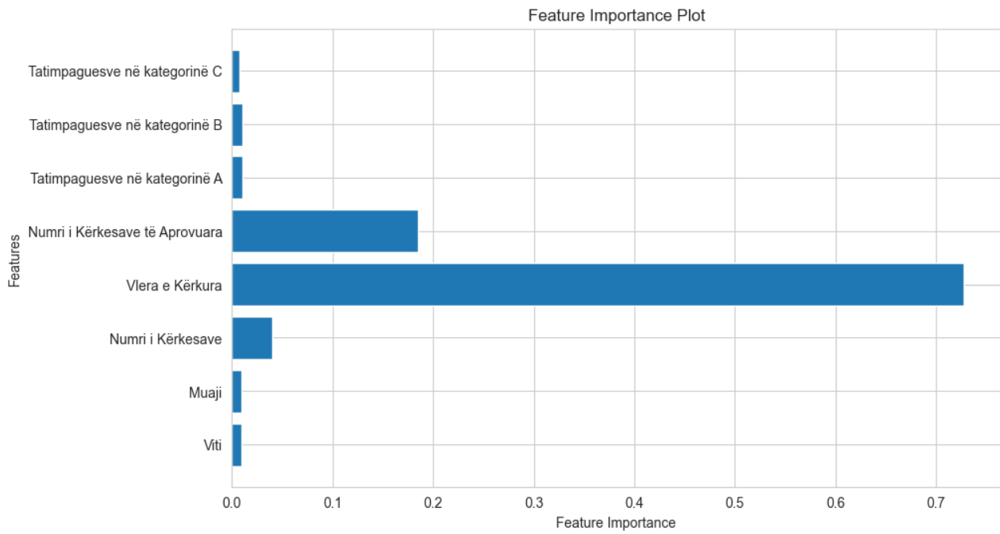
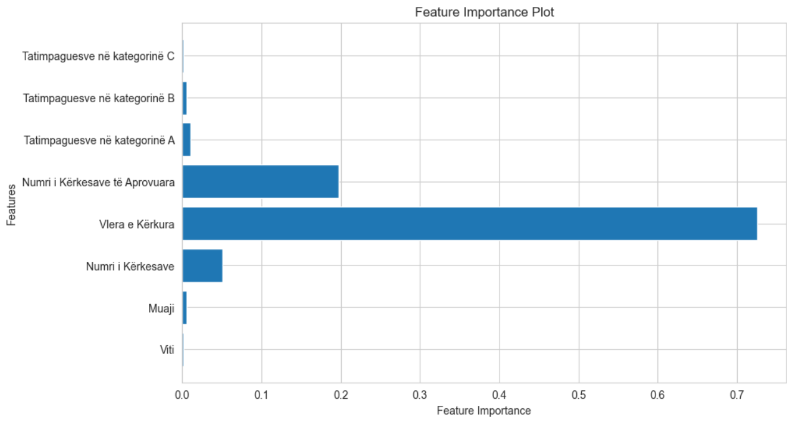
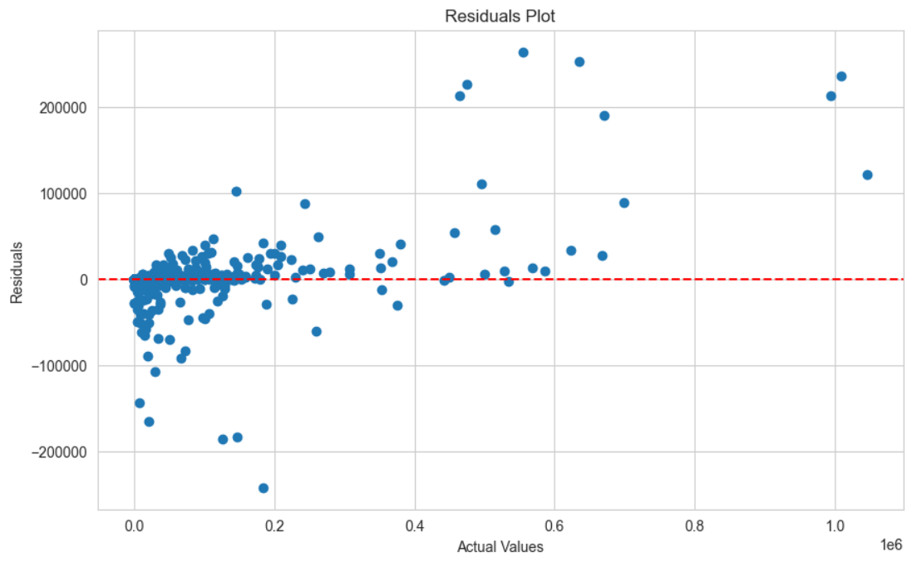
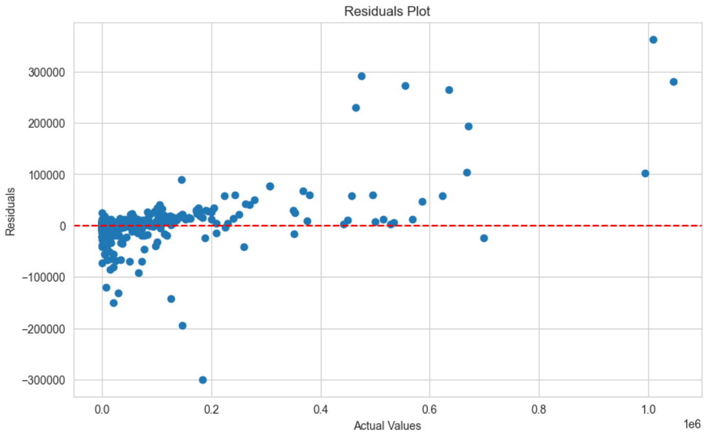
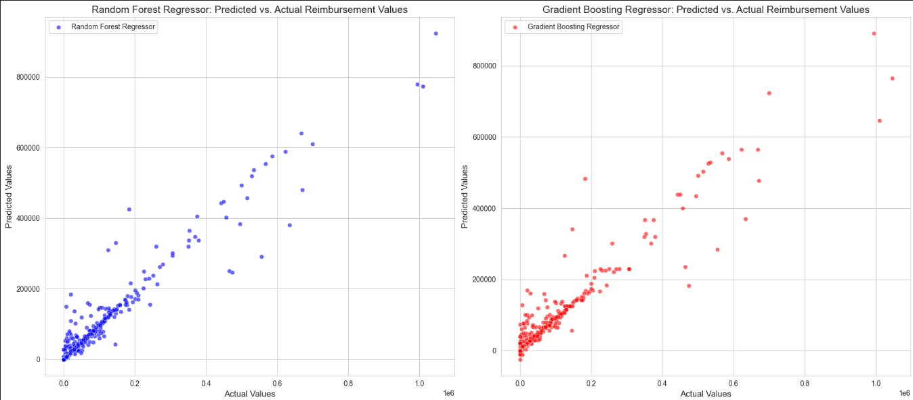

# Predicting Business Reimbursements using Machine Learning

## University and Course Information
- **University:** University of Pristina
- **Faculty:** Faculty of Electrical and Computer Engineering
- **Level:** Master's
- **Lecture:** Machine Learning
- **Lecturer:** Prof.Dr.Ing. Lule Ahmedi, PhD.c Mërgim H. HOTI
- **Students:** Valëza Grainca and Artan Thaqi

## Dataset Details
- **Source:** [ATK Open Data](https://www.atk-ks.org/en/open-data/)
- **Description:** The dataset comprises reimbursement requests and approvals for businesses operating in Kosovo
- **Size:** 4018 rows
- **Attributes:** 14
- **Format:** Excel

## Overview
This project aims to develop a machine learning model capable of predicting the reimbursement amounts for businesses. By leveraging historical data on business expenses and reimbursements, the model will learn patterns and relationships to make accurate predictions. This predictive tool can assist businesses in budgeting, financial planning, and optimizing reimbursement processes.

## Phase 1
### Key Steps
1. **Data Cleaning:**
   - **Data Quality Check:** Evaluate the overall quality of the dataset, including data types, consistency, and completeness.
   - **Data types:**
     - **Viti:** Categorical - Ordinal
     - **Muaji:** Categorical - Ordinal
     - **Sektori:** Categorical - Nominal
     - **Komuna:** Categorical - Nominal
     - **Numri i Kërkesave:** Numerical - Discrete
     - **Vlera e Kërkura:** Numerical - Continuous
     - **Numri i Kërkesave të Aprovuara:** Numerical - Discrete
     - **Vlerat e Aprovuara:** Numerical - Continuous
     - **Tatimpaguesve në kategorinë A:** Categorical - Nominal (Binary)
     - **Tatimpaguesve në kategorinë B:** Categorical - Nominal (Binary)
     - **Tatimpaguesve në kategorinë C:** Categorical - Nominal (Binary)
     - **Mesatarja e Ditëve të Kthimit:** Numerical - Continuous
     - **Lloji i Formularit të Deklarimit:** Categorical - Nominal
   - **Check for Null Values:** Identify and handle missing values appropriately. In this dataset, there are no null values, so no method is applied to handle them.
   - **Find and Remove Outliers:** Detect outliers using z-score. Remove or adjust outliers to prevent them from skewing the model's predictions.

     **Before Removing Outliers**

     

     **After Removing Outliers**

     

   - **Apply SMOTE (Synthetic Minority Over-sampling Technique):** Dealing with imbalanced classes, apply SMOTE to oversample the minority class and balance the dataset, enhancing the model's ability to learn from minority instances effectively. This technique targets the 'Sektori' as an imbalanced class. We can see the result before and after applying the SMOTE technique.

   **Before SMOTE**

   

   **After SMOTE**

   

   - **Identify Skewed Data:** Analyze the distribution of numerical features to identify skewed data. As we see in our numerical columns, the data is right-skewed.

   
   
   

   - **Size of dataset after preprocessing steps of phase one:** 3923 rows

## Phase 2
### Model Training, Feature Importance Visualization, and Residual Analysis

1. **Model Selection:**
   - Utilized two regression algorithms for training the dataset:
     - Random Forest Regressor
     - Gradient Boosting Regressor

2. **Model Training:**
   - Trained the dataset using both Random Forest Regressor and Gradient Boosting Regressor algorithms to capture the complex relationships between features and target variable.

3. **Selected Features for Prediction:**
   - The following features were selected for predicting business reimbursements for both models:
     - 'Viti' (Year)
     - 'Muaji' (Month)
     - 'Numri i Kërkesave' (Number of Requests)
     - 'Vlera e Kërkura' (Requested Amount)
     - 'Numri i Kërkesave të Aprovuara' (Number of Approved Requests)
     - 'Tatimpaguesve në kategorinë A' (Taxpayers in Category A)
     - 'Tatimpaguesve në kategorinë B' (Taxpayers in Category B)
     - 'Tatimpaguesve në kategorinë C' (Taxpayers in Category C)

4. **Target Variable:**
   - Our goal is to predict the 'Vlera e Aprovuar' (Approved Amount) for business reimbursements.

5. **Feature Importance Visualization:**
   - **Random Forest Regressor:**
     - Visualized the most important features derived by the Random Forest Regressor model to understand which attributes significantly influence the prediction of business reimbursements.
     - **Example Visualization:**
       

   - **Gradient Boosting Regressor:**
     - Visualized the most important features derived by the Gradient Boosting Regressor model to understand the significant factors affecting the prediction of business reimbursements.
     - **Example Visualization:**
       

6. **Residual Analysis:**
   - Conducted residual analysis for both Random Forest Regressor and Gradient Boosting Regressor models to evaluate their performance and identify any patterns or trends in prediction errors.
   - Residual plots were generated to visualize the distribution of residuals for each model.

   - **Random Forest Regressor Residual Plot:**
     

   - **Gradient Boosting Regressor Residual Plot:**
     

7. **Model Evaluation:**
   - Assessed the performance of both models using the following evaluation metrics:

     - **Random Forest Regressor:**
       - Mean Absolute Error: 8601.052059560508 means, on average, predictions are off by approximately $8601.05 from the actual values.
       - Mean Squared Error: 935525702.3306482 means, on average, the squared errors of predictions are approximately $935,525,702.33.
       - Root Mean Squared Error: 30586.364647186303 means, on average, predictions are off by approximately $30,586.36 from the actual values.
       - R-squared: 0.9281562779290515 means the model explains approximately 93% of the variance in the target variable, indicating a good fit.

     - **Gradient Boosting Regressor:**
       - Mean Absolute Error: 11892.009915317158 means, on average, predictions are off by approximately $11,892.01 from the actual values.
       - Mean Squared Error: 1202359162.0518725 means, on average, the squared errors of predictions are approximately $1,202,359,162.05.
       - Root Mean Squared Error: 34675.05100287341 means, on average, predictions are off by approximately $34,675.05 from the actual values.
       - R-squared: 0.9076647950422823 means the model explains approximately 91% of the variance in the target variable, indicating a good fit.

8. **Conclusion:**
   - Summarized the findings from Phase 2, highlighting the superior performance of Random Forest Regressor over Gradient Boosting Regressor based on the evaluation metrics and residual analysis.
    - The random forest regressor provided better results as we can see in below picture the actural vs. predicted values from both two models
    

## Phase 3
### Analysis and Evaluation (Retraining)

1. **Model Selection Criteria:**
   - We chose these models based on their robustness, flexibility, and ability to handle both numerical and categorical features present in our dataset.
   - Additionally, both Random Forest and Gradient Boosting are known for their excellent performance in regression tasks and are widely used in various industries for predictive modeling.

2. **Model Explanation:**
   - **Random Forest Regressor:**
     - Random Forest is an ensemble learning method that operates by constructing a multitude of decision trees during training and outputs the average prediction of the individual trees. It's known for its robustness against overfitting and ability to handle large datasets with high dimensionality.
     - Each tree in the Random Forest is trained on a bootstrapped sample of the data and a subset of features, providing diversity in the ensemble and reducing variance.
   
   - **Gradient Boosting Regressor:**
     - Gradient Boosting is another ensemble learning technique that builds a strong predictive model by sequentially adding weak learners (decision trees) and adjusting them to minimize the errors of the previous models.
     - It works by fitting the new model to the residual errors made by the previous models, effectively reducing bias and improving accuracy over iterations.

3. **Data Analysis:**
   - For retraining the models, we performed data analysis to identify potential improvements in model performance. We focused on two main cases:

   - **Case 1: Removing Data with Approved Amount Less Than $100,000:**
     - After removing instances where the approved reimbursement amount was less than $100,000, we observed a decrease in model accuracy for both the Random Forest Regressor and Gradient Boosting Regressor.
     - This decrease in accuracy was accompanied by an increase in Mean Absolute Error (MAE), indicating that removing these instances may have removed valuable information from the training data.

   - **Case 2: Removing Data with Requested Amount Greater Than $100,000:**
     - After removing instances where the requested reimbursement amount was greater than $100,000, we observed an improvement in model accuracy for both regression models.
     - This improvement was reflected in lower MAE values, suggesting that filtering out instances with exceptionally high reimbursement requests contributed to better model performance.

4. **Evaluation (Retraining):**

   - **Random Forest Regressor:**
     
     - **Case 1:**
         
       - Mean Absolute Error: 30158.60207672956
       - Mean Squared Error: 4321297181.066088
       - Root Mean Squared Error: 65736.5741506666
       - R-squared: 0.8662340476335653

     - **Case 2:**
         
       - Mean Absolute Error: 1867.1898695024076
       - Mean Squared Error: 34146837.63297841
       - Root Mean Squared Error: 5843.529552674343
       - R-squared: 0.9419820405763618
    
   - **Gradient Boosting Regressor:**

     - **Case 1:**
         
       - Mean Absolute Error: 37659.02566044428
       - Mean Squared Error: 5410344281.050412
       - Root Mean Squared Error: 73555.04252633134
       - R-squared: 0.8325225447219864

     - **Case 2:**
         
       - Mean Absolute Error: 2393.572409007479
       - Mean Squared Error: 36689967.70322908
       - Root Mean Squared Error: 6057.224422392576
       - R-squared: 0.937661077715592

5. **Conclusion:**
   - Our analysis and evaluation of retraining the models highlight the importance of carefully selecting data instances for model training. While removing instances with exceptionally high reimbursement requests improved model accuracy, removing instances with lower approved amounts had a negative impact on model performance.
   - Overall, the Random Forest Regressor outperformed the Gradient Boosting Regressor in terms of accuracy and performance metrics, indicating its suitability for predicting business reimbursements in this context.

