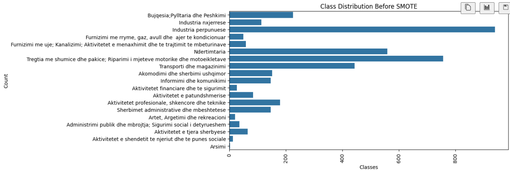
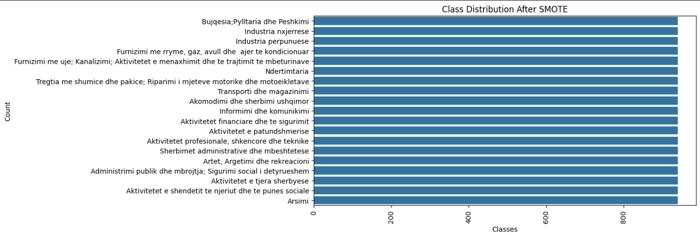
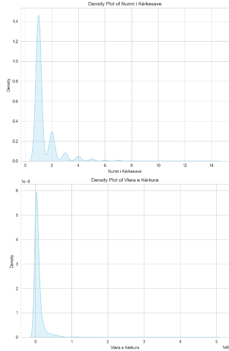
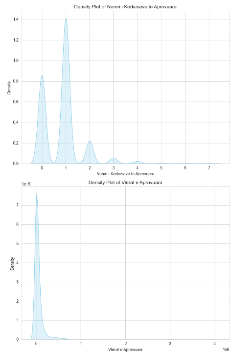

# Predicting Business Reimbursements using Machine Learning

## University and Course Information
- **University:** University of Pristina
- **Faculty:** Faculty of Electrical and Computer Engineering
- **Level:** Master's
- **Lecture:** Machine Learning
- **Lecturer:** Prof.Dr.Ing. Lule Ahmedi, PhD.c Mërgim H. HOTI
- **Students:** Valëza Grainca and Artan Thaqi
  
## Dataset Details
- **Source:** "https://www.atk-ks.org/en/open-data/"
- **Description:** The dataset comprises reimbursement requests and approvals for businesses operating in Kosovo
- **Size:**:  4018 rows
- **Attributes:**:  14
- **Format:** Excel

## Overview
This project aims to develop a machine learning model capable of predicting the reimbursement amounts for businesses. By leveraging historical data on business expenses and reimbursements, the model will learn patterns and relationships to make accurate predictions. This predictive tool can assist businesses in budgeting, financial planning, and optimizing reimbursement processes.

## Phase 1
## Key Steps
1. **Data Cleaning:**
   - **Data Quality Check:** Evaluate the overall quality of the dataset, including data types, consistency, and completeness.
   - ***Data types*** :
     - ***Viti:*** Categorical - Ordinal
     - ***Muaji:*** Categorical - Ordinal
     - ***Sektori:*** Categorical - Nominal
     - ***Komuna:*** Categorical - Nominal
     - ***Numri i Kërkesave:*** Numerical - Discrete
     - ***Vlera e Kërkura:*** Numerical - Continuous
     - ***Numri i Kërkesave të Aprovuara:*** Numerical - Discrete
     - ***Vlerat e Aprovuara:*** Numerical - Continuous
     - ***Tatimpaguesve në kategorinë A:*** Categorical - Nominal (Binary)
     - ***Tatimpaguesve në kategorinë B:*** Categorical - Nominal (Binary)
     - ***Tatimpaguesve në kategorinë C:*** Categorical - Nominal (Binary)
     - ***Mesatarja e Ditëve të Kthimit:*** Numerical - Continuous
     - ***Lloji i Formularit të Deklarimit:*** Categorical - Nominal
   - **Check for Null Values:** Identify and handle missing values appropriately. In this dataset there is no null value so there is no method applied to handel them.
   - **Apply SMOTE (Synthetic Minority Over-sampling Technique):** Dealing with imbalanced classes, apply SMOTE to oversample the minority class and balance the dataset, enhancing the model's ability to learn from minority instances effectively. This technique as target has the 'Sektori' as imbalenced class, we can see here the result before and after applying SMOTE technique.
   ***Before SMOTE***
       
    ***After SMOTE***
      
   - **Find and Remove Outliers:** Detect outliers using statistical methods such as z-score. Remove or adjust outliers to prevent them from skewing the model's predictions.
   - **Identify Skewed Data:** Analyze the distribution of numerical features to identify skewed data. As we see in our numerical columns we the data is right skewed.
      
